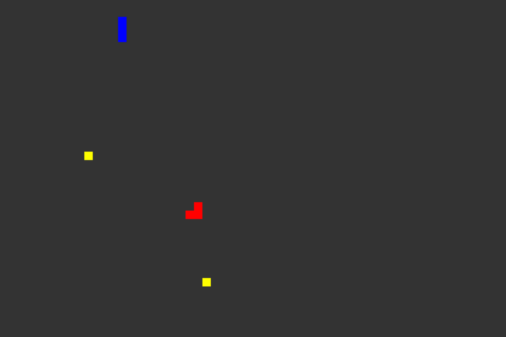

# redeSquad

Multiplayer online snake game.



## Play it Online

http://redesquad.com/

## About

This is the classic snake game with a twist. Each player joins a room with other
3 players, competing on eating yellow squares without colliding with others.

This game was made for our Computer Networking Applications class.

## Features

* 4 player versus snake game online.
* Multiple lobbies of 4 players.
* Client-Server communication via WebSockets.
* Client made in Haxe with HaxePunk.
* Server made in Node.js

## Development

### Prerequisites

#### Client

* Haxe 3.4.7
* haxe-ws 1.0.5
* HaxePunk 4.0.1
* lime 4.0.3
* openfl 4.9.2

#### Server

* Node.js
* ws 5.2.0

### Compiling and running

#### Client

```
lime test html5
```

#### Server

```
node main.js
```

## License: GPL

Copyright 2018 Javier Rizzo-Aguirre

This program is free software: you can redistribute it and/or modify
it under the terms of the GNU General Public License as published by
the Free Software Foundation, either version 3 of the License, or
(at your option) any later version.

This program is distributed in the hope that it will be useful,
but WITHOUT ANY WARRANTY; without even the implied warranty of
MERCHANTABILITY or FITNESS FOR A PARTICULAR PURPOSE.  See the
GNU General Public License for more details.

You should have received a copy of the GNU General Public License
along with this program.  If not, see <http://www.gnu.org/licenses/>.
